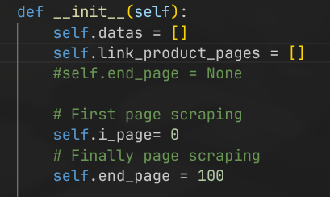
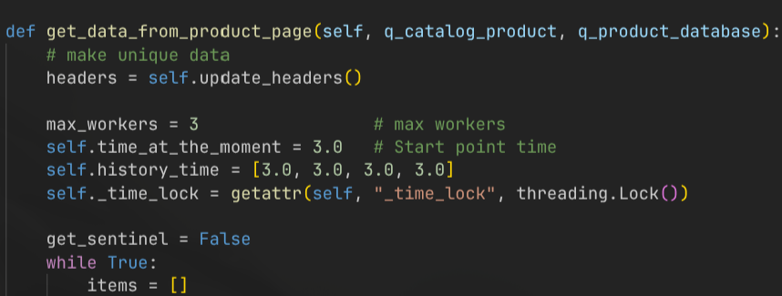
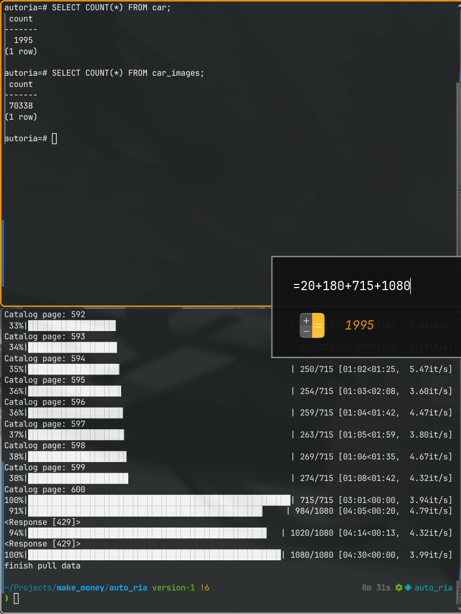

# Scraping site AUTO RIA

**url:** https://auto.ria.com/uk/search/?indexName=auto&page=0
**catalog:** used cars


# Step for run project

## Create & Setting '.env'

```.env
database=[name database]
user=[name user]
password=[password database]
port=[port for postgres]
sport=[port for docker]
host=[host database]
```

**Exapmple**
```.env
database=autoria
user=postgres
password=password
port=5432
sport=5434
host=localhost
```
---

## Setting for use main.py


### Stetting Environment

#### Create & connect to Environment

```bash
python -m venv .venv
source .../activate
```

#### Install library

```bash
pip install -r requirements.txt
```

### Database

#### Connect to database
```
psql -h localhost -p 5432 -U [user name] [database]
```


#### Create database+table
```sql
CREATE DATABASE autoria;
\c autoria
\i [round to database/create_table.sql]
```

#### Change password
```sql
ALTER USER [user name] WITH PASSWORD 'password';
```

### Or simple run in PGadmin4
```sql
CREATE TABLE IF NOT EXISTS car (
    id UUID PRIMARY KEY,
    url TEXT,
    title TEXT,
    price_usd FLOAT,
    odometer FLOAT,
    username TEXT,
    phone_number BIGINT, 
    images_count INTEGER,
    car_number VARCHAR(40),
    car_vin VARCHAR(40),
    datetime_found TIMESTAMP DEFAULT CURRENT_TIMESTAMP,    
    UNIQUE(price_usd, url, phone_number)
);

CREATE TABLE IF NOT EXISTS car_images (
    id UUID PRIMARY KEY,
    car_id UUID REFERENCES car(id),
    image_url TEXT UNIQUE,
    CONSTRAINT fk_car FOREIGN KEY(car_id) REFERENCES car(id) ON DELETE CASCADE
);
```

If **price_usd** or **url** or **phone_number** different, Item will add

```sql
UNIQUE(price_usd, url, phone_number)
```

We can run **.py** script

---
## Run in Docker

### Create docker-images 
(for this step need create **.env**)

#### Run docker script

```bash
docker-compose up --build
```

(if would like delete psql data)
```bash
docker-compose down -v
```
---


#### Create public docker-compose

```bash
docker build -t [user_name]/auto_ria:latest .
docker push [user_name]/auto_ria:latest
```
---

### Setting .py for parsing

#### Setting first and last page
(without last_page = work to last page)

#### For parsing product page


### My result (pages from 100 to 200)
- 1995/2000 (maybe found douplicate)
- 3.913894325 it/s 
- all time: 8m 31s


