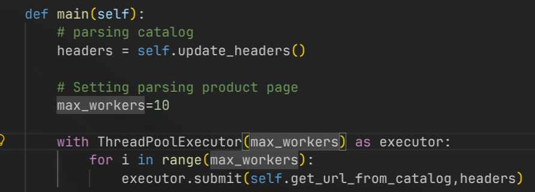
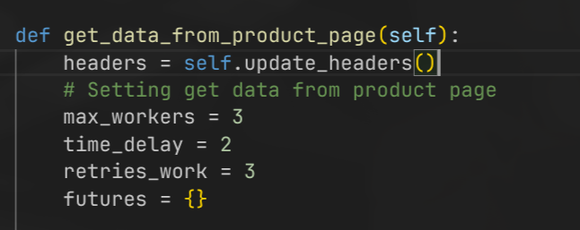
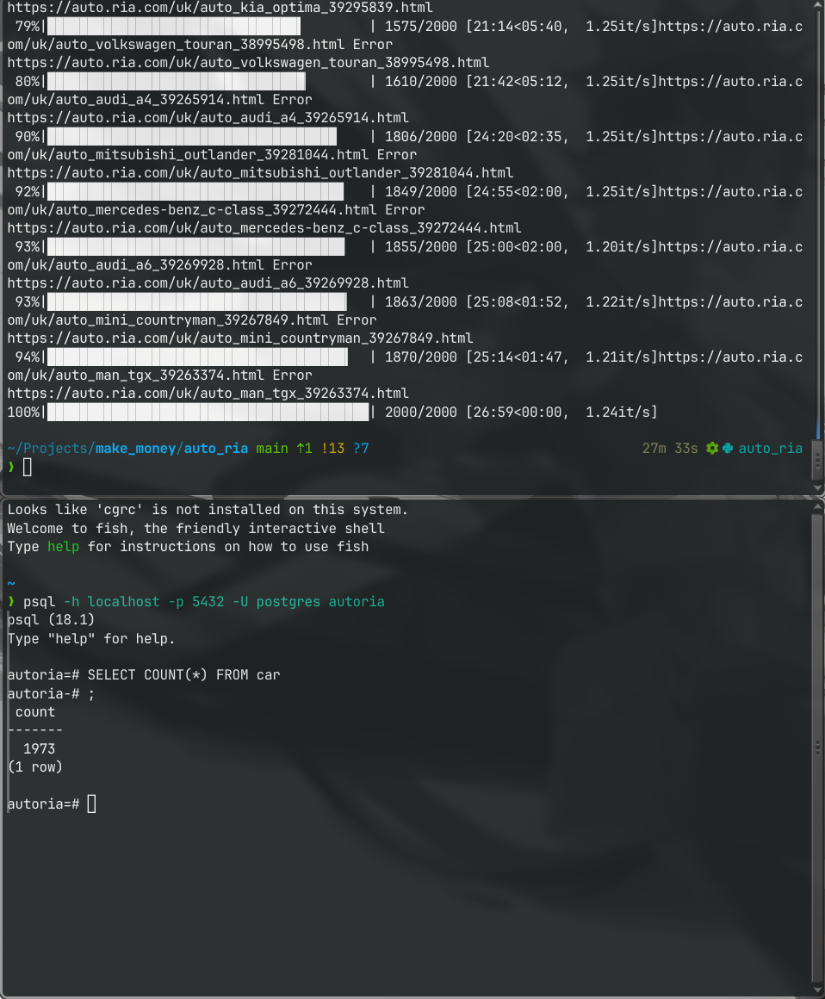

## Parsing
**url:** https://auto.ria.com/uk/search/?indexName=auto&page=0

## Prepering for run on Python

### first step

Don't forgot create and connect Environment
```
python -m venv .venv
source .../activate
```

**Install library**
```requirements.txt
pip install -r requirements.txt
```

### Database
#### run in pgsql

Connect to database
```
psql -h localhost -p 5432 -U [user name] [database]
```

Create database+table
```
CREATE DATABASE autoria;
\c autoria
\i [round to database/create_table.sql]
ALTER USER [user name] WITH PASSWORD 'password';
```

#### run in pgadmin4
```sql
CREATE DATABASE autoria
CREATE TABLE IF NOT EXISTS car (
    id UUID PRIMARY KEY,
    url TEXT,
    title TEXT,
    price_usd FLOAT,
    odometer FLOAT,
    username TEXT,
    phone_number BIGINT, 
    images_count INTEGER,
    car_number VARCHAR(40),
    car_vin VARCHAR(40),
    datetime_found TIMESTAMP DEFAULT CURRENT_TIMESTAMP,    
    UNIQUE(price_usd, url)
);

CREATE TABLE IF NOT EXISTS car_images (
    id UUID PRIMARY KEY,
    car_id UUID REFERENCES car(id),
    image_url TEXT UNIQUE,
    CONSTRAINT fk_car FOREIGN KEY(car_id) REFERENCES car(id) ON DELETE CASCADE
);
```

Create **.env**
```.env
database=autoria
user=postgres
password=password
port=5432
host=localhost
```

### Setting .py for parsing

#### For parsing catalog


#### For parsing product page


### My result 100 pages

- 1973/2000 (douplicate del)
- 1.195757576 it/s
- all time: 27m